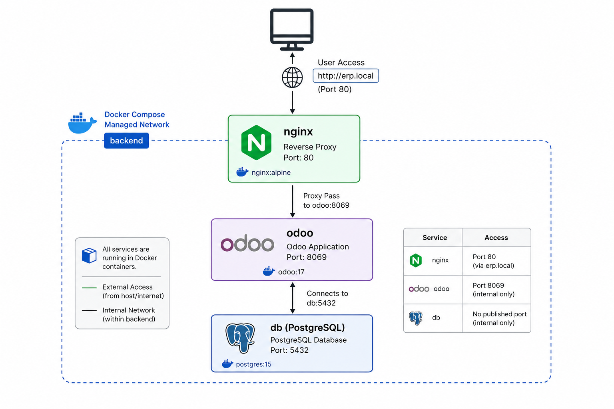

# ERP Odoo — Docker Stack (Odoo + PostgreSQL + Nginx)

## Prerequisites

- Docker Engine + Docker Compose v2
- A native Linux shell (WSL on Windows, or Linux/macOS). Avoid Git Bash
  on Windows: it rewrites absolute paths (`/var/lib/...`) and silently
  breaks `docker exec`/`docker cp`.
- Ports 80 and 8069 free on the host machine
- `sudo` access to edit `/etc/hosts` (for access via `erp.local`)

## Getting Started (5 commands)

```bash
git clone https://github.com/LAKHAL-Farah/test-devops.git && cd test-selection-devops/apps
cp .env.example .env        # then edit .env with real values
docker compose up -d
sudo sh -c 'echo "127.0.0.1 erp.local" >> /etc/hosts'
```

Open `http://erp.local` (or `http://localhost:8069`).

Check that everything is running:
```bash
docker compose ps   # all 3 services should be "healthy"
```

On first startup, Odoo shows the database creation screen: create a
database, note its exact name, and enter it in `.env` under
`ODOO_DB_NAME` (needed for the backup/restore scripts).

## Architecture

- `db` (postgres:15) — no published port, only accessible from `odoo`
  via the internal `backend` network.
- `odoo` (odoo:17) — exposed on `:8069`.
- `nginx` — reverse proxy on `:80`, routes `erp.local` to `odoo:8069`.

## Backup

```bash
cd apps
./backup.sh
```

Creates a `backup_YYYYMMDD_HHMMSS.tar.gz` archive in `/backup/`,
containing a PostgreSQL dump (`pg_dump`, without stopping the
containers) and a copy of the Odoo filestore. Each run is logged to
`/var/log/backup.log`.

A cron entry can be added to run it automatically every night at 2 AM:
```bash
crontab -e
# add:
0 2 * * * /absolute/path/to/apps/backup.sh >> /var/log/backup.log 2>&1
```

## Restore

Full, detailed procedure: see [`docs/restauration.md`](docs/restauration.md).

Quick summary:
```bash
docker compose down -v                          # simulate/actual crash
docker compose up -d db                          # DB only, first
docker exec -i rif_db createdb -U "$POSTGRES_USER" "$ODOO_DB_NAME"
docker exec -i rif_db psql -U "$POSTGRES_USER" -d "$ODOO_DB_NAME" < db.sql
# then restore the filestore — see docs/restauration.md for the method
docker compose up -d
```

## Quick Troubleshooting

- **`db` unhealthy**: check `POSTGRES_USER`/`POSTGRES_DB` in `.env`.
- **`odoo` unhealthy after filestore restore**: permissions issue on
  `/var/lib/odoo` (the container runs as non-root with reduced
  capabilities). See the dedicated section in `docs/restauration.md`.
- **`nginx` stays `unhealthy`**: it depends on `odoo` being `healthy`
  first (`depends_on: condition: service_healthy`) — check `odoo`
  before nginx.