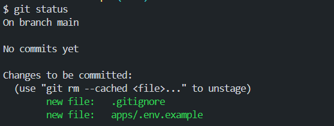
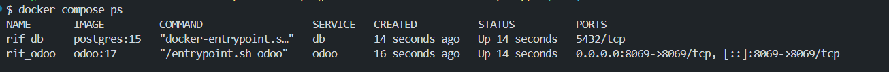
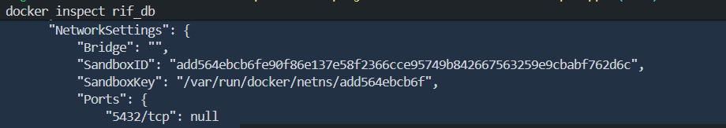
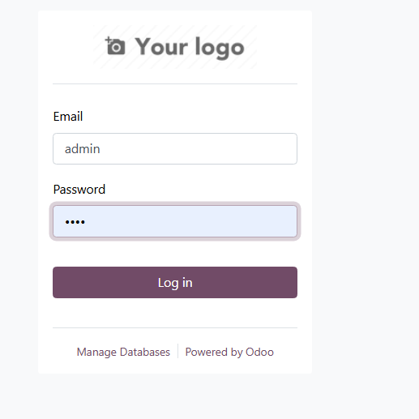
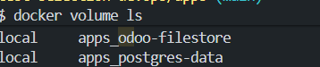
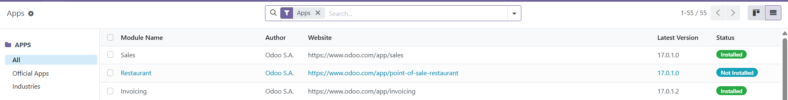
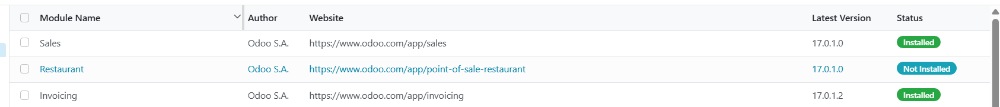
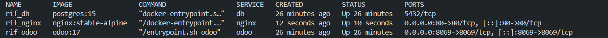
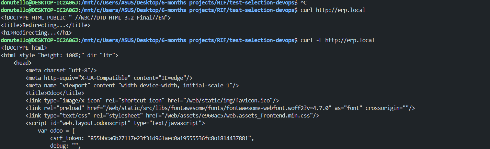
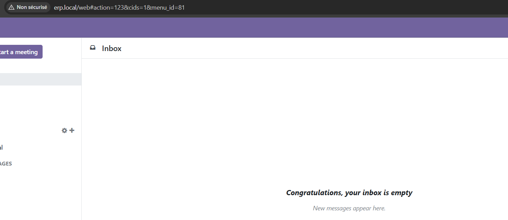

# Stage 1 - proof
## .env not commited

## containers created

## Postgres not exposed

## Odoo login page

## Persistence

sales installed

After restart -> all remains the same

## all service up

## Custom domain (erp.local) successfully resolving to Odoo

